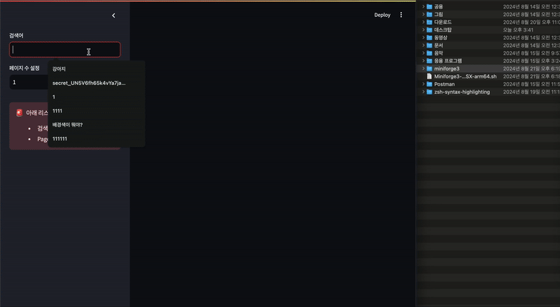
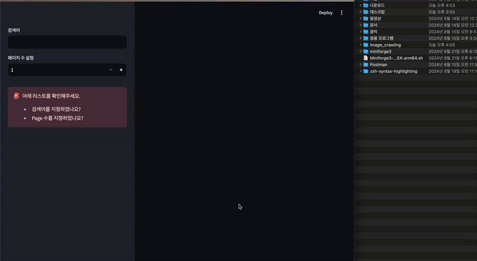

## 이미지 크롤링
### 레포지토리 clone 
```bash
# 레포지토리 clone 
git clone https://github.com/byungchan0725/Image_Crawling.git

# 이동
cd Image_Crawling
```

### 사용 방법   
- 가상환경  
- Docker 
#### 가상환경    
```bash 
# 파이썬 가상환경을 생성하세요. 
# (venv 기준)
# 3.11 가상환경 생성 
py -3.11 -m venv env  

# 가상환경 활성화 
source env/bin/activate 

# 필요한 패키지 설치  
pip install -r requirements.txt 

# streamlit 시작 
streamlit run app.py 
```


#### Docker 환경 
```bash 
# 도커 이미지 빌드 
docker build -t crawling . 

# 도커 이미지 실행 
docker run -v ~/image_crawling:/root -p 8501:8501 crawling  
```

<br><br>

### 사용 예시 

#### Streamlit을 가상 환경으로 생성하여 이미지 저장 
- 이미지 저장 경로: `~/crawling_data_storage/` 



<br>

#### Docker를 사용하여 이미지 저장 
- 이미지 저장 경로: `~/image_crawling/crawling_data_storage/` 



